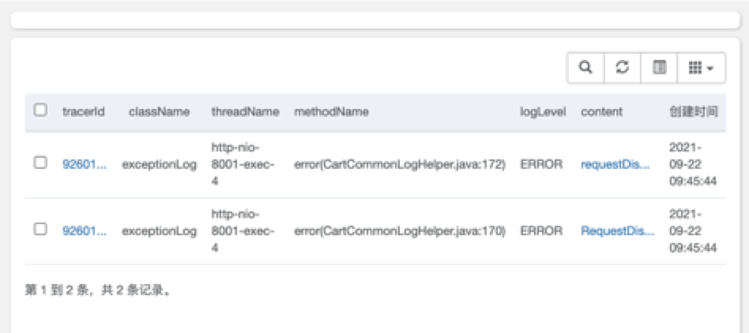

# 简介
该项目架构设计文章：https://my.oschina.net/1Gk2fdm43/blog/5312538

该项目主要为海量日志（秒级GB级）的搜集、传输、存储而设计的全套方案。区别于传统的如ELK系列套件，该项目主要是为了解决超大量级的日志（出入参、链路跟踪日志）从搜集到最后检索查询的中途产生的高昂硬件成本、性能低下等问题。

核心点在于 **性能、成本** 。

较ELK系列方案（filebeat、mq传输、es存储等常见方案），该框架拥有10倍以上的性能提升，和70%以上的磁盘节省。这意味着，在日志这个功能块上，使用相同的硬件配置，原本只能传输、存储一秒100M的日志，采用该方案，一秒可以处理1GB的日志，且将全链路因日志占用的磁盘空间下降70%。

由于该方案着重于极致的吞吐性能和极低的磁盘占用，而对数据全程进行了压缩。故并不适合于需要es关键字模糊查询的场景使用，而仅支持提前设定好的索引字段查询。数据库使用的是clickhouse集群，配置中心采用的etcd，如果之前没有相关经验的，还涉及了新技术的学习成本，以及需要对部分源码进行改造，故未必适合大部分项目使用。建议关注实现方案和处理超大量级的数据、缓冲、入库等代码逻辑即可，整套思路可适用于多种场景。
# 使用说明
[使用说明](https://gitee.com/jd-platform-opensource/jlog/blob/master/%E4%BD%BF%E7%94%A8%E8%AF%B4%E6%98%8E.md)
# 背景
京东App作为一个巨大量级的请求入口，涉及了诸多系统，为了保证系统的健壮性、和请求溯源，以及出现问题后的问题排查，通常我们保存了用户请求从出入参、系统中途关键节点日志（info、error）、链路日志等，并且会将日志保存一段时间。

日志系统基本划分为几个模块：收集（filebeat、logstash等），传输（kafka、tcp直传等），存储（es，mysql、hive等），查询（kibana、自建）。

以传统日志解决方案为例，当有一个G的日志产生后，日志写本地磁盘（占用磁盘1G），读取后写入mq（mq占用2G，单备份），消费mq写入es（es占用1G），共需占用磁盘4GB，附带着网络带宽占用，和同体量的服务器资源占用（单服务器秒级处理100M）。

则以京东App的体量，当秒级百G日志产生时，所耗费的硬件资源相当庞大，成本已到了难以承受的地步。

该日志框架即为在有所取舍的情况下，支撑海量日志的场景所研发，如前文所讲，该方案在同等硬件配置下，较filebeat+mq+es的模式秒级 **日志吞吐量提升10倍，且全链路磁盘占用下降了70%以上** 。

# 方案简介
详细的可以看开头那篇文章。
这里只放两张图基本能说明原理。

基本流程为通过filter获取web请求出入参、自定义log4j、logback的appender搜集中途打印的日志，通过请求入口时生成的tracerId进行关联，写入本地内存（取代写磁盘），进行压缩（字符串空间占用减少80%以上），通过Udp发往worker端（取代mq），worker接收数据抽取索引字段，并入库clickhouse，除未来查询要用的索引字段外，其他内容全程压缩直至入库。
